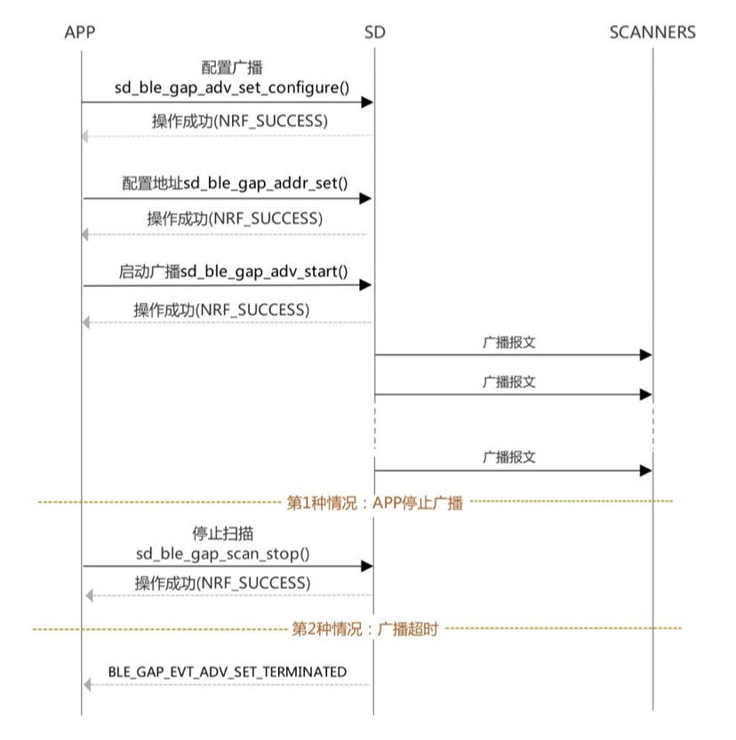
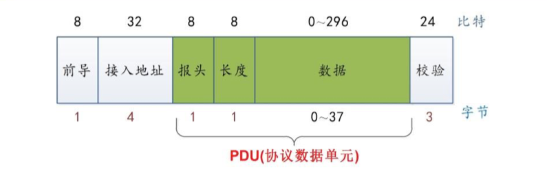
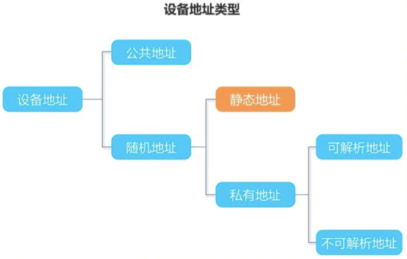
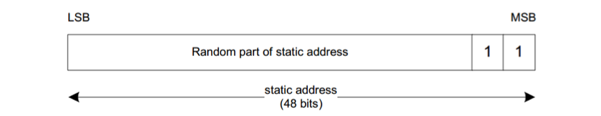
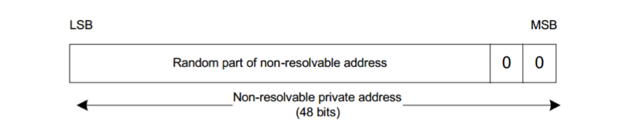

# BLE广播

## 基本概念和流程
广播就是设备将自身意愿展示的信息按照伙一定的间隔以“扫描者”可理解的方式向周边发射。

广播有如下四种类型，广播报文的报头中有4个位专门用于指示广播报文的类型。
1. 通用广播：最常用的广播方式，可以被扫描，接收到连接请求时可以作为从设备进入一个连接。
2. 定向广播：针对于快速建立连接的需求，定向广播会占满整个广播信道，定向广播的数据净荷只包含广播者和发起者地址，发起者收到发给自己的定向广播后，会立即发送连接请求。定向广播最长时间不能超过1.28s，并且不能被主动扫描。
3. 不可连接广播：广播数据，而不进入连接态，也不响应扫描，这是唯一一个允许硬件设备只有发射机的广播类型，因为它不会需要接收任何数据。
4. 可发现广播：不可连接，但可以响应扫描。

Nordic SDK中实现广播流程
1. 广播的配置：应用程序首先要根据自己的需求配置广播的间隔、广播的模式以及广播中包含哪些数据，这称为广播初始化，广播初始化配置好各项参数之后，最终调用API函数sd_ble_gap_adv_set_configure()将配置传递给SoftDevice完成配置。配置成功之后，SoftDevice会返回"NRF_SUCCESS"。
2. 广播的启动：应用程序初始化广播成功后，广播并没有启动，应用程序需要根据初始化中设置的模式启动广播，应用程序启动广播最终是调用API函数sd_ble_gap_adv_start()通知SoftDevice启动广播，SoftDevice启动广播成功后会返回"NRF_SUCCESS"。
3. 广播的停止：广播的停止有2种放课后，一是应用程序主动停止广播，即应用程序通过调用API函数sd_ble_gap_adv_stop()通知SoftDevice停止广播，SoftDevice成功停止广播后返回"NRF_SUCCESS"；二是超时停止广播，即广播设置了超时时间，在设定的超时时间 内没有和中心设备建立连接，广播即会超时停止，这时SoftDevice会向应用程序提交"BLE_GAP_EVT_ADV_SET_TERMINATED"事件。



`
APP: Application应用程序
SD: SoftDevice
SCANNERS: 扫描设备
`

## 广播数据包报文结构
因为有的域的长度超过了一个字节，所以在传输的过程中就涉及到多字节中哪个字节先传输的问题，BLE报文传输时的字节序和比特序如下：
* 字节序：大多数字节域是从低字节开始传输的。注意，并不是所有的多字节域都是从低字节开始传输的。
* 比特序：各个字节传输时，每个字节都是从低位开始。



## 广播可以包含的数据
SDK里面定义了广播数据结构体ble_advdata_t，该结构体描述了广播可以包含的数据，ble_advdata_t结构体声明如下：
```c
typedef struct
{
    ble_advdata_name_type_t      name_type;                           // 设备名称类型
    uint8_t                      short_name_len;                      // 裁剪的设备名称的长度
    bool                         include_appearance;                  // 是否包含外观
    uint8_t                      flags;                               // flags
    int8_t *                     p_tx_power_level;                    // 发射功率等级
    ble_advdata_uuid_list_t      uuids_more_available;                // 服务UUID部分列表
    ble_advdata_uuid_list_t      uuids_complete;                      // 服务UUID完整列表
    ble_advdata_uuid_list_t      uuids_solicited;                     // 服务请求UUID列表
    ble_advdata_conn_int_t *     p_slave_conn_int;                    // 从机连接间隔范围
    ble_advdata_manuf_data_t *   p_manuf_specific_data;               // 制造商自定义数据
    ble_advdata_service_data_t * p_service_data_array;                // 服务数据
    uint8_t                      service_data_count;                  // 服务数据的长度(字节数)
    bool                         include_ble_device_addr;             // 是否包含设备地址
    ble_advdata_le_role_t        le_role;                             // 公用于NFC，BLE广播设备为NULL
    ble_advdata_tk_value_t *     p_tk_value;                          // 公用于NFC，BLE广播设备为NULL
    uint8_t *                    p_sec_mgr_oob_flags;                 // 公用于NFC，BLE广播设备为NULL
    ble_gap_lesc_oob_data_t *    p_lesc_data;                         // 公用于NFC，BLE广播设备为NULL
} ble_advdata_t;
```

## 设备地址
BLE设备地址可以使用公共地址(Public Device Address)或随机地址(Random Device Address)两种地址类型，一个BLE至少使用一种地址类型，当然也可以同时
具备两种地址类型。公共地址和随机地址的长度一样，都是48位(6个字节)的。BLE设备地址类型的关系如下图。


* 公共地址：从IEEE申请(购买)，IEEE保证地址分发的唯一性。
* 随机静态地址(Static Device Address)：自己定义，上电初始化完成后不能修改。
* 随机不可解析私有地址(Non-resolvable private address)：定时更新地址，蓝牙核心规范建议15分钟更新一次。
* 随机可解析私有地址(RPA: Resolvable Private Address)：通信双方使用共享的身份解析密钥(IRK: Identity Resolving Key)，生成和解析可解析私
有地址。只有一台设备拥有另一台广播设备的IRK时，才能跟踪该广播设备的活动。
  
### 公共地址
公共地址由两部分组成，公共地址由制造商从IEEE申请(购买)，由IEEE注册机构为该制造商分配的机构唯一标识符OUI(Organizationally Unique Identifier)。
这个地址是独一无二的，不能修改。
LSB => company_assigned(24 bits)

MSB => company_id(24 bits)

公共地址能明确的指示出设备，同时具有唯一性，但是安全度不够，试想当我们携带使用公共地址的BLE设备时，不法分子可以通过技术手段跟踪该唯一的巫颂地址，即可跟踪
到该BLE设备的使用者。

为了加强隐私保护，蓝牙内核协议中提供了另外一种地址：随机地址，随机地址是随机产生的，不是固定分配的，随机地址又为多种类型，以适应不同的应用场景对隐私的需求。

### 随机地址

#### 随机静态地址
1. 随机静态地址的定义
随机静态地址是随机生成的48位地址，随机静态地址必须符合以下要求:
   * 静态地址的最高2位有效位必须是1。
   * 静态地址最高2位有效位之后的其余部分不能全为0。
   * 静态地址最高2位有效位之外的其余部分不能全为1。
   * 一个上电周期内不变。
   


```c
#if ADDRESS_TEST == 0
    // 定义地址结构体变量my_addr
    static ble_gap_addr_t my_addr;

    /*--------------设置设备地址: 随机静态地址----------------*/
    my_addr.addr[0] = 0x11;
    my_addr.addr[1] = 0x22;
    my_addr.addr[2] = 0x33;
    my_addr.addr[3] = 0x44;
    my_addr.addr[4] = 0x55;
    // 注意地址最高位必须为1,其它所有的位不能同时为0，也不能同时为1
    // 11111110
    my_addr.addr[5] = 0xFE;
    // 地址类型设置为随机静态地址
    my_addr.addr_type = BLE_GAP_ADDR_TYPE_RANDOM_STATIC;
    // 写入地址
    err_code = sd_ble_gap_addr_set(&my_addr);
    if (err_code != NRF_SUCCESS) {
        NRF_LOG_INFO("Set address failed!");
    }

    err_code = sd_ble_gap_addr_get(&my_addr);
    if (err_code == NRF_SUCCESS) {
        NRF_LOG_INFO("Address Type: %02X\r\n", my_addr.addr_type);

        NRF_LOG_INFO("Address: %02X:%02X:%02X:%02X:%02X:%02X\r\n",
                        my_addr.addr[0], my_addr.addr[1],
                        my_addr.addr[2], my_addr.addr[3],
                        my_addr.addr[4], my_addr.addr[5]
                     );
    }
#endif
```

#### 不可解析私有地址
1. 不可解析私有地址的定义
设备生成不可解析私有地址时必须符合以下要求：
   * 地址的最高2位有效位必须是0
   * 地址最高2位有效位之外的其余部分不能全为0 
   * 地址最高2位有效位之外的其余部分不能全为1
   * 不可解析私有地址不能和公共地址一样
   


不可解析私有地址相当于周期性改变的随机静态地址，不可解析私有地址一直在变化， 并且该地址是个随机数，没有提供任何可解析的信息，因此，很难通过跟踪地址来跟踪设备， 所以具有很高的安全性。但是因为地址一直变化，又没有可解析的信息，这就导致受信任的 设备也没法分辨该地址的真实身份。

由此可见，不可解析私有地址在隐私上“敌我”不分，不管是谁，统统让你无法分辨我 的真实身份。因此不可解析私有地址在实际应用中使用的不多。

```c
static ble_gap_privacy_params_t my_addr = {0};

// 初始化地址模式、地址类型和循环周期，私有地址由协议栈自动生成
my_addr.privacy_mode = BLE_GAP_PRIVACY_MODE_DEVICE_PRIVACY;
my_addr.private_addr_type = BLE_GAP_ADDR_TYPE_RANDOM_PRIVATE_NON_RESOLVABLE;

// 地址循环周期设置为15秒，蓝牙内核协议推荐值是15分钟。
my_addr.private_addr_cycle_s = 15;
my_addr.p_device_irk = NULL;

err_code = sd_ble_gap_privacy_set(&my_addr);

if (err_code != NRF_SUCCESS) {
NRF_LOG_INFO("")
}
#endif
```

### 本地设备名称

本地设备名称(Local Name)有如下两种类型
* 完整的本地名称(Complete local name): 不能截断
* 裁剪的本地名称(Shortened local name): 可以被截断，截取内容必须是从名称的起始位置开始连续的字符。

设备名称示例:
完整的本地设备名称是: BT_Device_Name，裁剪的本地设备名称可以是BT_Device，也可以是BT_Dev等但不能是T_DEV(因为T_DEV不是从名称的起始位置开始的)。

应用场景:
* 完整的本地名称: 设备愿意对外展示全部的设备名称，并且设备名称不长，广播包可以容纳。
* 裁剪的本地名称: 设备名称很长，一个广播包无法容纳，或者我们不想在广播的时候对外展示全部的设备名称，这时可以使用裁剪的设备名称，当连接建立后，主机可以通过
读GAP设备名称特征来获取完整的设备名称。
  
### 外观
外观是GAP服务的一个特征，外观的值是在GAP初始化函数里面设备的，广播初始化时只能选择广播包是否包含外观，而不能设置外观的值。所以，配置外观的步骤是首先在GAP
初始化函数中根据实际应用设置外观特征的值，然后在广播初始化函数中设置包含或不包含外观。

```c
// 设置GAP的外观属性
// 如果需要设置其他外观可以查看ble_types.h这个头文件
err_code = sd_ble_gap_appearance_set(BLE_APPEARANCE_GENERIC_RUNNING_WALKING_SENSOR);
APP_ERROR_CHECK(err_code);
```
可以通过查看`ble_types.h`这个文件，来查看相应的外观值。

### Flags
Flags是位字段的序列，当其中任何一个位不为零且广播可连接时广播包中应包含flags,否则，Flags可以被忽略。Flags只能包含在广播包中，扫描响应包中不能包含Flags。
Flags的作用是在广播包中加入如下标志：
* 有限可发现模式。
* 一般可发现模式。
* 不支持BR/EDR。
* 设备同时支持LE和BR/EDR(控制器)。
* 设备同时支持LE和BR/EDR(主机)。

有了这些标志，当设备被扫描到后，对端设备即可根据这些标志执行相应动作，如Flags指示了设备不支持BR/EDR，对端设备扫描到该设备后，即可知道此设置仅支持LE，不支持
传统蓝牙。Flags的格式如下表:
<table>
   <thead>
      <tr>
         <th>数据类型</th>
         <th>位</th>
         <th>描述</th>
      </tr>
   </thead>
   <tbody>
      <tr>
         <td rowspan="7">Flags</td>
         <td>0</td>
         <td>有限可发现模式</td>
      </tr>
      <tr>
         <td>1</td>
         <td>一般可发现模式</td>
      </tr>
      <tr>
         <td>2</td>
         <td>不支持BR/EDR</td>
      </tr>
      <tr>
         <td>3</td>
         <td>设备同时支持LE和BR/EDR(控制器)。</td>
      </tr>
      <tr>
         <td>4</td>
         <td>设备同时支持LE和BR/EDR(主机)。</td>
      </tr>
      <tr>
         <td>5-7</td>
         <td>保留</td>
      </tr>
   </tbody>
</table>

#### 有限可发现模式和一般可发现模式的区别
有限可发现模式有时间的限制，一般维持的时间是30s，而一般可发现模式没有时间的限制，有限可发现模式的广播间隔比一般可发现模式小。

从时间的限制上，我们可以看出有限可发现模式对连接的迫切性和目的性比一般可发现模式高，一个处于有限可发现模式的设备正在广播，那么他一定是刚被用户操作过并且希望被连接。

#### 不支持BD/EDR
不支持BD/EDR表示设备是单模设备，公支持蓝牙低功耗，不支持传统蓝牙。

我们项目中是将Flags定义了一般可发现模式，并且仅支持LE模式。
```c
ble_advertising_init_t init;
memset(&init, 0, sizeof(init));

init.advdata.flags = BLE_GAP_ADV_FLAGS_LE_ONLY_GENERAL_DISC_MODE;   // Flag: 一般为可发现模式，不支持BR/EDR
```

### 发射功率等级

#### 发射功率等级的定义 
发射功率等级(TX Power Level)，指的是传输该广播包时使用的发射功率值。 长度1个字节，单位是dBm。发射功率等级定义如下:

|数据类型|描述|
|:-----:|:-----|
|发射功率等级(TX Power Level)|大小:1字节。<br/>范围: -127至+127dBm。|

发射功率等级可以用来计算伙路径损耗

pathloss = TX Power Level - RSSI。

### 服务的UUID
#### UUID
广播数据中，一般会包含一个服务UUID列表，用以展示自己支持的服务，但是GAP和GATT服务的UUID不能加到广播包中。广播中可以根据自身的情况包含一部分服务的UUID
或者包含所有服务的UUID。部分UUID列表和完整的服务UUID列表同时只能用一种，不能在广播数据中同时包含这两种。

什么时候使用部分服务UUID列表呢?
* 广播数据无法容纳全部服务的UUID
* 设备不想在广播阶段对外展示其所支持的全部的服务。

#### What's UUID?
UUID(通用唯一识别码: Universally Unique Identifier)是一个128位的数字，用来标识伙属性类型。服务也是一种属性，所以需要UUID来标志。
1. 16位的UUID
因为128位的UUID相当长，设备间为了识别数据的类型需要发送长达16个字节的数据。为了提高传输效率，SIG定义了一个"UUID基数"，结合一个较短的16位数使用。
   
2. UUID分为标准的UUID和厂商自定义的UUID
* 标准的UUID: 由SIG发布，采用UUID基数+16位UUID的形式，如心率服务的UUID是0x180D，使用的基数是: 00000000-0000-1000-8000 - 00805F9B34FB。
* 厂商自定义的UUID: 同样采用UUID基数+ 16位UUID的形式，由厂商定义，如BLE串口服务的UUID是0x0001，使用的UUID基数是6E400001-B5A3-F393-E0A9 - E50E24DCCA9E。

为了方便管理，增加UUID的可读性，蓝牙低功耗使用的那部分UUID被分为下列几组:
* 0x1800~0x26FF: 用作服务类能用唯一标识码。
* 0x2700~0x27FF: 用于标识计量单位。
* 0x2800~0x28FF: 用于区分属性类型。
* 0x2900~0x29FF: 用作特征描述。
* 0x2A00~0x7FFF: 用于区分特征类型。
