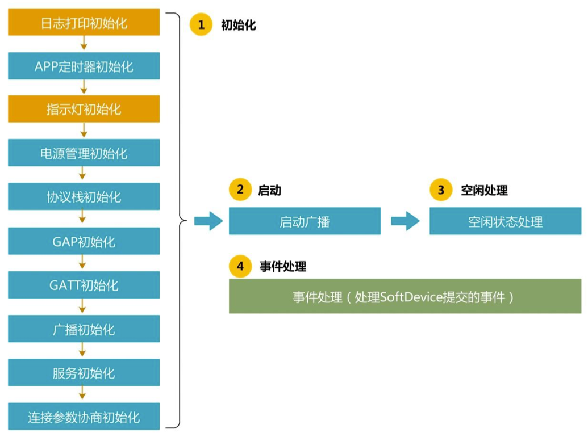
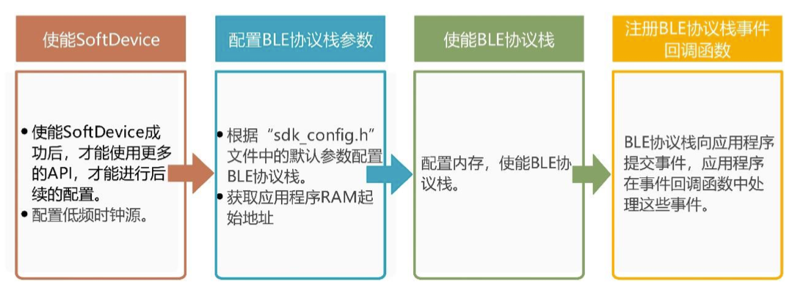
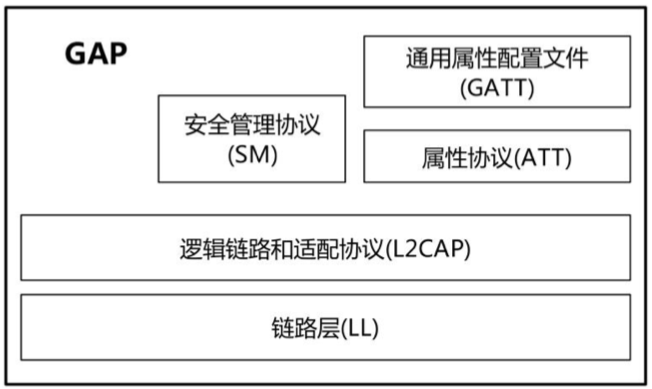

# BLE基本功能

## 此工程实现的参数及功能
<table>
    <thead>
        <tr>
            <th>项目</th>
            <th>名称</th>
            <th>内容</th>
        </tr>
    </thead>
    <tbody>
        <tr>
            <td rowspan="3">广播参数</td>
            <td>广播间隔</td>
            <td>187.5ms</td>
        </tr>
        <tr>
            <td>广播超时时间</td>
            <td>无限广播不超时</td>
        </tr>
        <tr>
            <td>广播模式</td>
            <td>快速广播</td>
        </tr>
        <tr>
            <td rowspan="3">广播数据</td>
            <td>设备名称</td>
            <td>James' BLE</td>
        </tr>
        <tr>
            <td>外观</td>
            <td>包含</td>
        </tr>
        <tr>
            <td>Flags</td>
            <td>一般可发现模式，不支持BR/EDR</td>
        </tr>
        <tr>
            <td rowspan="4">首选连接参数</td>
            <td>最小连接间隔</td>
            <td>100ms</td>
        </tr>
        <tr>
            <td>最大连接间隔</td>
            <td>200ms</td>
        </tr>
        <tr>
            <td>从机延迟</td>
            <td>0</td>
        </tr>
        <tr>
            <td>监督超时</td>
            <td>4s</td>
        </tr>
        <tr>
            <td rowspan="3">连接参数协商</td>
            <td>首次协延时</td>
            <td>5s</td>
        </tr>
        <tr>
            <td>每次协商之间的间隔</td>
            <td>30s</td>
        </tr>
        <tr>
            <td>最次协商最大尝试次数</td>
            <td>3次</td>
        </tr>
        <tr>
            <td rowspan="2">包含的服务</td>
            <td>GAP服务</td>
            <td><strong>强制包含</strong></td>
        </tr>
        <tr>
            <td>GATT服务</td>
            <td><strong>强制包含</strong></td>
        </tr>
        <tr>
            <td rowspan="2">指示灯</td>
            <td>D1闪烁</td>
            <td>指示正在广播</td>
        </tr>
        <tr>
            <td>D1常亮</td>
            <td>指示已经和中断设备建立连接</td>
        </tr>
    </tbody>
</table>

## BLE程序流程

一个BLE程序通常需要至少包含4个必要的部分: 系统初始化、启动、空闲管理和事件处理。



### 流程概述

1. 日志打印初始化`tri_app_log.h(app_log_init)`
```c
// 设置log输出终端伙(根据sdk_config.h中的配置设置输出终端为UART或者RTT)
NRF_LOG_DEFAULT_BACKENDS_INIT();
```
2. APP定时器初始化`tri_app_timer.h(timers_init)`
3. 指示灯初始化`tri_app_leds.h(leds_init)`
4. 电源管理初始化`tri_app_power.h(power_management_init)`
5. 协议栈初始化`tri_app_ble.h(ble_stack_init)`
```c
// 请求使能SoftDevice，该函数会根据sdk_config.h文件中低频时钟的设置来配置低频时钟
err_code = nrf_sdh_enable_request();
APP_ERROR_CHECK(err_code);

// 定义保存应用程序RAM起始地址的变量
uint32_t  ram_start = 0;

err_code = nrf_sdh_ble_default_cfg_set(APP_BLE_CONN_CFG_TAG, &ram_start);
APP_ERROR_CHECK(err_code);

// 使能ble协议栈
err_code = nrf_sdh_ble_enable(&ram_start);
APP_ERROR_CHECK(err_code);
```
注意这里有几点非常重要，如果想使用SoftDevice一定要要先烧入相应的SoftDevice hex文件，然后再将SoftDevice使能。
另外需要注意的是我们使用的是gcc来进行烧写，内存分配的。所以需要更改`config/gcc_nrf52.ld`文件，否则在`nrf_sdh_ble_enable`
这个方法执行的时候会抛出`err_code = 4`错误，这个错误是表示没有足够的内存来分配数据。

```
MEMORY
{
  FLASH (rx) : ORIGIN = 0x26000, LENGTH = 0x5a000
  RAM (rwx) :  ORIGIN = 0x200022f0, LENGTH = 0xdd10
}
```

上面的表示了烧写的起始地址等数据。

6. GAP初始化`tri_app_ble.h(gap_params_init)`
7. GATT初始化`tri_app_ble.h(gatt_init)`
8. 广播初始化`tri_app_ble.h(advertising_init)`
9. 服务初始化`tri_app_ble.h(services_init)`
10. 连接参数协商初始化`tri_app_ble.h(conn_params_init)`
11. 启动广播`main.c(advertising_start)`
12. 空闲状态处理`main.c(idle_state_handle)`

### 日志打印
日志打印有两种手段，一种是通过UART串口进行数据打印，一种是通过JLINK RTT来进行日志打印
日志有几个级别
* INFO
* WARNING
* DEBUG
* ERROR

选择什么样的方式来进行日志打印可以在`sdk_config.h`来进行配置

### APP定时器

#### APP定时器作用
APP 定时器基于实时计数器 RTC1 的软件定时器，APP 定时器允许用户同时创建多个 定时任务，APP 定时器在 RTC1 中断处理程序中检查超时并执行超时处理程序的调用，在软 中断（SWI0）处理定时列表，RTC1 中断和 SWI0 均使用低中断优先级 APP_LOW。 在 BLE 的程序中，APP 定时器的用途主要有以下几种：

1. 按键消抖以及实现长按和短按。
2. 定时驱动 LED 指示灯，和 BLE 事件配合实现 BLE 的状态指示（如指示灯 D1 闪烁指示 正在广播，常亮指示已经连接）。
3. 连接参数更新，连接成功后，开启 APP 定时器，超时后进行连接参数更新。
4. 用户创建定时任务，实现各种定时任务，如创建一个超时时间为 1 秒的 APP 定时器作 为实时时钟的时基。

### 电源管理
某些程序对于功耗要求较高，需要SOC进行休眠处理。

电源管理运行后，在使用API等待应用程序事件时，只要SoftDevice不使用CPU，CPU就会进入IDLE状态，此时，SoftDevice直接处理的中断不会唤醒应用程序。应用程序
中断将预期唤醒应用程序。另外，当系统进入System Off模式时，使用电源管理模块的API可以确保在断电之前停止SoftDevice服务。

使用电源管理功能时，首先要初始化电源管理模块，之后在主循环中运行电源管理，这样，当CPU空闲时会执行电源管理API，进入低功耗模式等待事件唤醒，从而实现低功耗。

### BLE协议栈
使用BLE功能之前，需要先初始化BLE协议栈，BLE协议栈初始化包括使能SoftDevice、配置BLE协议栈参数、使能BLE协议栈事件回调函数。



### GAP

#### GAP作用
GAP(Generic Access Profile)，通用访问配置文件。GAP定义了设备如何彼此发现、建立连接以及如何实现绑定，同时描述了设备如何成为广播者和观察者，并且实现
无需连接的传输。同时，GAP定义了如何用不同类型的地址来实现隐私性和可解析性。GAP和BLE体系结构中底层的关系。



GAP的作用就是定义以下4个方面:
* GAP角色
* 可发现性模式和规程
* 连接模式和规程
* 安全模式和规程

从学习GAP开始，有两个非常重要的概念: 模式(Mode)规程(Procedure)，它们用来描述设备的行为，定义以及区别如下：
* 模式(Mode): 模式描述是设备的工作状态，当一个设备被配置为按照某种方式操作一段较长时间时，称为模式。广播模式，表示设备正处在广播状态，一般会持续很长时间。
* 规程(Procedure): 规程描述的是在有限时间内进行特定的操作，如连接参数更新规程，它是在较短的时间内执行了连接参数更新的操作。

#### GAP角色
BLE为设备在物理传输定义了4种GAP角色，一个设备可以支持多个GAP角色，可以是广播者也可以是外围设备:
* 广播者: 广播发送者，不是可连接的设备
* 观察者: 扫描广播，不能够启动连接
* 外围设备(peripheral): 广播发送者，是可连接的设备，连接后成为从设备
* 中心设备(center): 扫描广播启动连接，连接后成为主设备

要理解 GAP 为什么分为 4 种角色，就要知道蓝牙标准制定时的考虑。我们知道BLE主打低功耗、所以 BLE 体系结构中，为了最大可能优化设备，节省功耗，所有的层都采用了
非对称的设计，对于物理层的无线电装置，可以是这 3 种形式。 
* 芯片只有发射机：只能发射无线信号，不能接收无线信号，硬件成本低。 
* 芯片只有接收机：只能接收无线信号，不能发射无线信号，硬件成本低。
* 芯片同时具有接收机和发射机：既可以接收无线信号，也可以发射无线信号，硬件成本较高。

这样，当某个应用只需要在设备之间单向传输数据时，其中一个设备可以作为广播者， 采用只有发射机的芯片，另外一个设备可以作为观察者，采用只有接收机的芯片，
这就构成 了非对称系统，如下图所示。它们实现了单向的传输，并且用了尽量少的硬件资源，所以，功耗会更低，同时理论上造价也会更低。

#### GAP安全模式

|安全模式和规程|广播者|观察者|外围设备|中心设备|
|:-----|:----:|:-----:|:-----:|:-----:|
|安全模式1|E|E|O|O|
|安全模式2|E|E|O|O|
|认证规程|E|E|O|O|
|授权规程|E|E|O|O|
|连接数据签名规程|E|E|O|O|
|认证签名数据规程|E|E|O|O|

`E: 不包含的 O: 可选择的`

安全模式和等级
<table>
    <thead>
        <tr>
            <th>安全模式</th>
            <th>等级</th>
            <th>描述</th>
        </tr>
    </thead>
    <tbody>
        <tr>
            <td>安全模式1</td>
            <td colspan="2">通过不同级别的加密保证安全</td>
        </tr>
        <tr>
            <td rowspan="4"></td>
            <td>等级1</td>
            <td>无安全性（无认证和加密）</td>
        </tr>
        <tr>
            <td>等级2</td>
            <td>带加密的未认证配对</td>
        </tr>
        <tr>
            <td>等级3</td>
            <td>带加密的认证配对</td>
        </tr>
        <tr>
            <td>等级4</td>
            <td>带加密的LE安全连接配对</td>
        </tr>
        <tr>
            <td>安全模式2</td>
            <td colspan="2">通过不同级别的加密保证安全</td>
        </tr>
        <tr>
            <td rowspan="2"></td>
            <td>等级1</td>
            <td>带数据签名的未认证配对</td>
        </tr>
        <tr>
            <td>等级2</td>
            <td>带数据签名的认证配对</td>
        </tr>
    </tbody>
</table>

#### GAP服务
GAP层定义了GAP服务，它的作用是用来确定设备的信息，GAP服务包含了5个特征：
设备名称、外观特征、外围设备首选连接参数、中心设备地址解析和可解析私有地址。4类GAP角色对想GAP服务的需求如下表所示，正如前面所述，广播者和观察者没有服务，
当然不能包含GAP服务，外围设备和中心设备对GAP服务是强制包含的。

| |广播者|观察者|外围设备|中心设备|
|:----:|:----:|:----:|:-----:|:----:|
|GAP服务|E|E|M|M|

对于每一个GAP角色，当其包含GAP服务时，对GAP的特征的需求也是不一样的，如下表所示，对于设备名称和外观特征，外围设备
和中心设备是强制包含的，对于外围设备首连接参数，外围设备是可选择是否包含的，而中心设备是不能包含的，对于中心设备地址解析和可解析私有地址是有条件包含的。

|特征|广播者|观察者|外围设备|中心设备|
|:----:|:----:|:----:|:----:|:----:|
|设备名称|E|E|M|M|
|外观特征|E|E|M|M|
|外围设备首选连接参数|E|E|O|E|
|中心设备地址解析|E|E|C3|C2|
|可解析私有地址|E|E|C3|C3|

`
C2: 如果支持链路层隐私，强制包含该特征，否则不包含
C3: 如果支持链路层徇私，此特征可选择包含，否则不包含
`

##### Device Name 特征
Device Name 特征应包含UTF-8字符串的设备名称，一个设备只允许有一个设备名称，长度范围是0~248字节。如果设备是可发现的，设备名称特征应不需认证或授权可读，
如果设备是不可发现的，设备名称特征在没有认证或授权时应不可读。

#### Appearance特征
外观是一个16位的数值，外观由SIG定义，用来列举设备的外观样式，一个设备只允许有一个外观特征。

外观指示设备是普通手机、键盘等等，通常被用来在用户界面的设备旁显示设备的小图标，通过图标向用户展示设备。
`可以在ble_types.h`头文件中查到。

以我们项目来开讲一般有以下几种常用到，血压计、跑步传感器、骑车传感器

```c
#define BLE_APPEARANCE_BLOOD_PRESSURE_ARM                   897
#define BLE_APPEARANCE_BLOOD_PRESSURE_WRIST                 898
#define BLE_APPEARANCE_RUNNING_WALKING_SENSOR_IN_SHOE      1089
#define BLE_APPEARANCE_RUNNING_WALKING_SENSOR_ON_SHOE      1090
#define BLE_APPEARANCE_RUNNING_WALKING_SENSOR_ON_HIP       1091
#define BLE_APPEARANCE_GENERIC_CYCLING                     1152
#define BLE_APPEARANCE_CYCLING_CYCLING_COMPUTER            1153
#define BLE_APPEARANCE_CYCLING_SPEED_SENSOR                1154
#define BLE_APPEARANCE_CYCLING_CADENCE_SENSOR              1155
#define BLE_APPEARANCE_CYCLING_POWER_SENSOR                1156
#define BLE_APPEARANCE_CYCLING_SPEED_CADENCE_SENSOR        1157 
```

### GATT 初始化
GATT程序模块的作用是用于协商和跟踪GATT连接参数和更新数据长度，在BLE程序中，初始化GATT程序模块只需要调用 nrf_ble_gatt_init()就可完成初始化

### 广播初始化
广播者对外广播的目的是为了像周边的设备显示自己的存在和"我是谁"，所以广播包中需要按照规定的格式写入一些数据。

设备每次广播时，会在3个广播信道上发送相同的报文。这些报文被称为一个广播事件。除了定向报文以外，其广播事件均可以选择"20ms~10.28s"不等的间隔。

#### 配置广播数据和模式
##### 广播数据
广播初始化中需要配置广播包中包含哪些数据，一般情况下，建议广播包中至少包含：设备名称、Flags、外观和首要服务的UUID。

##### 广播模式和间隔
连接有，外围设备需要先广播，向中央设备通告自己的存在，配置广播时，我们需要确定在我们的应用中需要使用哪一种广播模式，SDK中定义了下面几种可连接的广播模式：

|广播模式|广播行为|
|:-----|:-----|
|BLE_ADV_MODE_IDLE|没有可连接的广播在进行中|
|BLE_ADV_MODE_DIRECTED_HIGH_DUTY|定向广播（高占空比）。断开连接后会立即尝试和最近连接过的对端设备进行重连接。这种模式对于无缝恢复意外断开连接的对 端设备非常有用。但是因为他会堵塞广播通道，影响其他设备的广播，所以持续时间不能过长。|
|BLE_ADV_MODE_DIRECTED|定向广播（低占空比）|
|BLE_ADV_MODE_FAST|快速地广播一小段时间|
|BLE_ADV_MODE_SLOW|慢速广播，类似于快速广播。默认情况下相对于快速广播使用更长的广播间隔和广播持续时间。因为广播间隔较长，所以连接此类设备速度会慢一些。不过，连接间隔和持续时间是由用户定义的|

不同的广播模式的广播间隔和持续时间不一样，广播间隔和广播持续时间的影响如下：
* 广播间隔：单位0.625ms，广播快，容易被中心设备发现，慢则省电。
* 广播持续时间：保持广播的时间，为了省电，可以广播一段时间之后进入休眠。

### 服务初始化

#### 初始化排队写入模块
服务初始化部分需要做的是初始化排队写入模块以及添加服务和对于此工程，因为没有除了GAP服务和GATT服务之外的其他服务，所以只需初始化排队写入模块即可。

写入GATT特性可以在单个写入命令或一系列命令中完成，显然，将写操作分割为几个命令使得可以写比单个包长的属性值，这样的一系列写命令，称为排队写入，排队写入由
多个准备写入命令和一个执行写命令组成。

排队写入模块使用SoftDevice的能用属性配置文件(GATT)服务器接口提供排队写入的实现，将此模块添加到GATT服务器，以实现支持对某些或全部特性的排队写入，这样，
GATT客户商就可以使用一系列命令写入这些特性。

### 连接参数协商初始化
#### 连接参数协商
连接参数协商模块的作用是用于启动和执行连接参数协商规程。

很多应用场景中，从机和主机刚建立连接时，会使用“快速”的连接参数以达到迅速交 换信息的目的，但是，从机和主机之间并不是一直需要快速的交换信息，因为这样会加快从 机电池能量的消耗，这时候，从机就希望能降低连接事件的频度(连接间隔)，从而降低功耗， 延长电池工作时间。

从机可以通过向主机发送“连接参数更新请求”来请求修改连接参数，当从机向主机发 送请求后，如果主机觉得合适，会同意这个请求并返回结果代码为接受的“连接参数更新响 应”，如果主机觉得不合适，则会返回结果代码为拒绝的“连接参数更新响应”。从机在请求 被拒绝后可以再次发送新的请求。由此我们可以看出，连接参数的更新能不能得以实现是由 主机来决定的，所以，为了减少主机拒绝从机连接参数更新请求的可能性，在请求里面，连 接间隔是一个范围而不是一个固定值，从而让主机有一个可选择的范围，增加主机接受请求 的可能性。

对于主机来说，在连接建立时，主机通过连接请求数据包发送连接参数。当连接活跃了 一段时间，连接参数也许不再适用于当前使用的服务。出于提高效率的目的，连接参数需要 进行更新。这时候，主机向从机发送连接更新请求(注意：不是连接参数更新请求，不要和 从机发送的连接参数更新请求混淆了)，即 LL_CONNECTION_UPDATE_REQ，当中携带了 新的参数。这些参数不必进行协商，从机只有两种选择：要么接受和使用它们，要么断开链 路。

### 启动广播
广播参数配置完成之后，调用库函数ble_advertising_start()即可启动广播，该函数的输入参数advertising_mode必须和广播初始化中设置的广播模式一样，如
广播初始化中设置的广播模式是BLE_ADV_MODE_FAST，那么输入参数advertising_mode也必须是BLE_ADV_MODE_FAST
