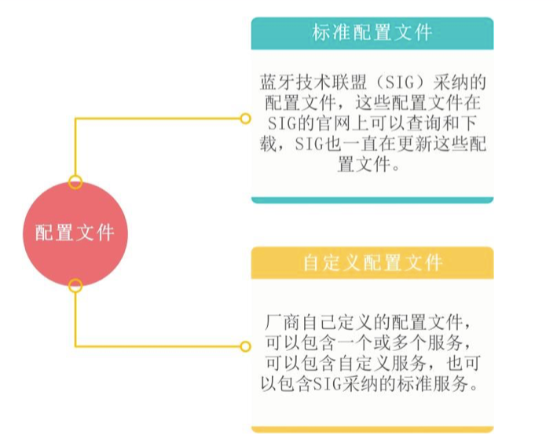
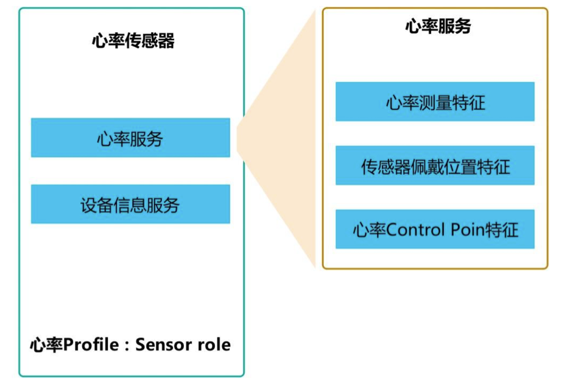
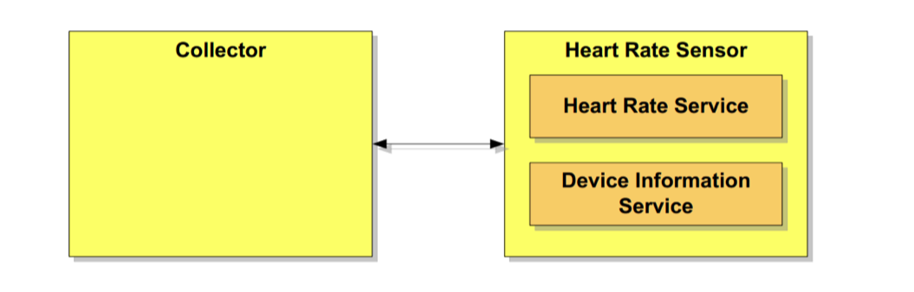
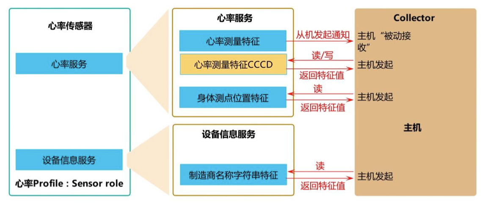

# BLE标准Profile

## 配置文件、服务和特征
### Profile(配置文件)
配置文件是一种规范，配置文件定义为可能的应用，并规定了蓝牙设备与其它蓝牙设备通信的一般行为。配置文件构建于蓝牙标准基础上，以更明确界定蓝牙模块传输的数据类型。设备的应用决定了它需要支持的配置文件种类。

1. 标准配置文件和自定义配置文件
为了方便用户使用，体现BLE的互操作性，SIG采纳了很多常用Profile并在官网上发布，这些Profile被称为标准Profile，如心率Profile，健康体温计Profile等。但是在实际应用中，应用场景多种多样，厂商对功能的设备需求也各不相同，仅仅依靠标准Profile是无法满足这些需求的，因此，蓝牙内核协议允许厂商定义适用于自己产品需求的Profile，这些Profile称为自定义Profile，如串口透传Profile、蓝牙灯控Profile等等。

因此，配置文件分为两种类型: **标准配置文件**和**自定义配置文件**。



标准Profile的规格书在SIG的官网可以查询和下载 [https://www.bluetooth.com/specifications/gatt](https://www.bluetooth.com/specifications/gatt)。

2. Services(服务)
服务是一组特征和通过它们所公开的行为的集合，一个服务可以包含多个特征。如心率服务包含Heart Rate measurement、Body Sensor Location和Heart Rate Control Point
这些特征。服务也和Profile一样，分为标准服务和自定义服务，标准服务是由SIG采纳发布的，而自定义服务是厂商自己定义的。
   
服务存在于从机中，每个服务代表从机的一个能力，Profile规格书中规定了需要包含哪些服务，哪些服务是必须包含的，哪些服务是可选择包含的。

3. Characteristic(特征)和描述符
* 特征
特征包含三个部分：声明、数值和描述符，其中声明和数值是必不可少的，而描述符可以是一个或多个。
  
特征的数值是我们最终要操作的数据，如心率传感器的心率测量特征，它的特征值就是心率值和RR-Interval值，心率传感器通过将此特征值发送给主机，从而使能主机可以
获取心率传感器的心率值和RR-Interval值，当然，主机也可以主动读取心率测量特征来获取这心率传感器的心率值和RR-Interval值。

通过无线传输数据本身是一件简单的事情，但是BLE为了达到低功耗、互操作性以及适应各种场景的目的，给这些数值设定了一些规范，从而让事情变的复杂的多。换句话说就
是要让数据传输变得简单、可靠、通用，那么事先定的规则就多，规则多了，理解起来就会困难一些。

服务的规格书中会定义服务需要包含哪些特征，下图是心率服务规格书中定义的心率服务包含的特征，其中心率测量是强制包含的，身体测点位置特征是可选择包含的，心率
Control Point的条件包含的(如果支持能量消耗统计，必须包含，否则，不能包含该特征)。



**特征性质**

特征性质是一个8位字段，确定了特征数值属性对一系列操作的支持情况，各个位的描述如下表所示：

|性质|值|描述|
|:----|:-----:|:-----|
|广播(Broadcast)|0x01|广播位，如果置位，必须要有服务器特征配置描述符(SCCD)。|
|读(Read)|0x02|置位表示允许读。|
|无响应写(Write Without Response)|0x04|无需响应写入。|
|写(Write)|0x08|置位表示允许写。|
|读(Notify)|0x10|通知位，如果置位，必须要有客户端特征配置描述符(CCCD)。|
|指示(Indicate)|0x20|指示位，如果置位，必须要有客户端特征配置描述符(CCCD)。|
|签名认证写入(Authenticated Signed Writes)|0x40|签名认证写入。|
|扩展特征(Extended Properties|0x80|扩展性质位。|

**特征数值**
特征数值是一个属性，特征性质字段给出了特征数值属性的访问权限，如读/写等等，通过特征性质字段的描述，确定了特征数值属性可以执行的操作类型。

### 需求描述
心率Profile给出了明确的规定：如果一个设备声称符合心率Profile，应以服务指定的方式支持此服务中所有指示的强制功能(过程强制)，这也同样适用于指示的可选的或有
条件具备的功能。因此，我们需要阅读SIG发布的相关文档，根据文档的描述列出需求，之后才能编写代码实现需求。

#### 角色
心率Profile定义了如下图所示的两类角色：心率传感器和集中器(Collector）,心率传感器是测量心率和其它信息的设备，集中器是接收心率传感器心率测量值和其它信息
设备。

* 心率传感器应是GATT服务器。
* 集中器应是GATT客户端。



#### 需求表和依据
<table>
	<thead>
		<tr>
			<th>序号</th>
			<th>项目</th>
			<th>名称</th>
			<th>内容</th>
		</tr>
	</thead>
	<tbody>
		<tr>
			<td rowspan="4">1</td>
			<td rowspan="4">1</td>
			<td>设备名称</td>
			<td>Heart Sensor</td>
		</tr>
		<tr>
			<td>服务UUID</td>
			<td>0x180D(心率服务UUID)，0x180A(设备信息服务UUID)。广播包中包含全部服务的UUID。</td>
		</tr>
		<tr>
			<td>外观</td>
			<td>心率腕带，编码833。</td>
		</tr>
		<tr>
			<td>Flags</td>
			<td>一般可发现模式，不支持BR/EDR</td>
		</tr>
		<tr>
			<td rowspan="3">2</td>
			<td rowspan="3">广播参数</td>
			<td>广播间隔</td>
			<td>187.5ms</td>
		</tr>
		<tr>
			<td>广播超时时间</td>
			<td>无限广播，不超时</td>
		</tr>
		<tr>
			<td>广播模式</td>
			<td>快速广播</td>
		</tr>
		<tr>
			<td rowspan="4">3</td>
			<td rowspan="4">首选连接参数</td>
			<td>最小连接间隔</td>
			<td>400ms</td>
		</tr>
		<tr>
			<td>最大连接间隔</td>
			<td>650ms</td>
		</tr>
		<tr>
			<td>从机延时</td>
			<td>0</td>
		</tr>
		<tr>
			<td>监督超时</td>
			<td>4s</td>
		</tr>
		<tr>
			<td rowspan="3">4</td>
			<td rowspan="3">连接参数协商</td>
			<td>首次协商延时</td>
			<td>5s</td>
		</tr>
		<tr>
			<td>每次协商之间的间隔</td>
			<td>30s</td>
		</tr>
		<tr>
			<td>最次协商最大尝试次数</td>
			<td>3次</td>
		</tr>
		<tr>
			<td>5</td>
			<td>GAP服务</td>
			<td>设备名称</td>
			<td>心率传感器可以支持设备名称特性的写入属性，以便允许收集器将设备名称写入心率传感器</td>
		</tr>
		<tr>
			<td rowspan="2">6</td>
			<td rowspan="2">包含的服务</td>
			<td>心率服务</td>
			<td>见《心率服务包含的特征》</td>
		</tr>
		<tr>
			<td>设备信息服务</td>
			<td>见《设备信息服务包含的特征》</td>
		</tr>
		<tr>
			<td rowspan="2">7</td>
			<td rowspan="2">指示灯</td>
			<td>D1闪烁</td>
			<td>指示正在广播</td>
		</tr>
		<tr>
			<td>D1常亮</td>
			<td>指示已经和中心设备建立连接</td>
		</tr>
		<tr>
			<td rowspan="2">8</td>
			<td rowspan="2">APP定时器</td>
			<td>心率测量特征值通知发送定时器</td>
			<td>周期性定时器，超时时间1s</td>
		</tr>
		<tr>
			<td>传感器接触状态更新定时器</td>
			<td>周期性定时器，超时时间5s</td>
		</tr>
	</tbody>
</table>

心率服务包含的特征

<table>
	<thead>
		<tr>
			<th>服务</th>
			<th>特征名称</th>
			<th>特征性质</th>
			<th>安全许可</th>
		</tr>
	</thead>
	<tbody>
		<tr>
			<td rowspan="3">心率服务</td>
			<td>心率测量</td>
			<td>Notify(通知)</td>
			<td>无</td>
		</tr>
		<tr>
			<td>心率测量客户端特征描述符(CCCD)</td>
			<td>读，写</td>
			<td>无</td>
		</tr>
		<tr>
			<td>传感器身体测量点位置</td>
			<td>读</td>
			<td>无</td>
		</tr>
	</tbody>
</table>

设备信息服务包含的特征

|服务|特征名称|特征性质|安全许可|
|:----|:-----|:-----:|:-----:|
|设备信息服务|Manufacturer Name String|读|无|

#### 广播数据
一般地，建议在广播数据中至少包含设备名称、Flags、外观和首要服务的UUID列表。

#### 数据传输
BLE的数据传输是双向的，蓝牙内核协议中定义了两类数据传输的规程：服务器发起规程和客户端发起规程，通俗地来说就是从机主动向主机发起数据传输和主机向从机发起数据传输。

1. 从机主动发起
从机如果想主动发起数据传输，只能通过两种方式：通知(Notify)和指示(Indicate)，从机可以通过这两种方式主动将数据发送给主机，它们的区别如下：
   * 通知(Notify): 从机发送通知后，不会关心主机有没有接收到，通知属于不可靠消息。通知需要使用客户端配置描述符(CCCD)配置(CCCD使能/关闭通知)。
   * 指示(Indicate): 从机发送指示后，必须得到主机的应答才能发送下一条指示，指示属于可靠消息。指示同样需要使用客户端配置描述符(CCCD)配置(CCCD使能/关闭指示)。
   
2. 主机主动发起
主机通过从机发送的通知或指示可以获取从机的数据，但是数据发送的主动权在从机，主机是"被动接收"，主机无法决定从机什么时候发送数据，同时主机也无法将数据发送给从机。
   
主机如想主动发起数据传输，也有两种方式：读和写，通过读和写，主机可以读/写特征值和特征描述符。

* 读(Read): 主机通过"读"可以读取从机的特征值和特征描述符，从而获取伙从机的数据。
* 写(Write): 主机通过"写"可以写入从机的特征值和特征描述符，从而将数据发送给从机。

综上所述，从机通过通知和指示可以将数据发送给主机，实现从机到主机的数据传输，主机通过读和写可以读取从机的数据，也可以将数据发送给从机。


#### 心率服务的特征
* 心率测量特征: 特征性质是通知，本例中创建一个超时时间1s的周期性APP定时器，定时发送心率数据。
* 心率测量特征CCCD: 特征性质是读写，主机可以通过写CCCD使能/关闭心率测量特征的通知，主机可以通过"读"读取CCCD值。
* 身体测点位置特征: 特征性质是读，主机可以通过"读"读取身体测点位置特征值，从而获取身体测点位置。

#### 设备信息服务的特征
* 制造商名称字符串特征: 特征性质设置为"读"，即主机只能通过"读"读取该特征值，获取制造商名称字符串，从机是无法主动发送该特征值的。

## 代码
```c
// <q> BLE_MY_DIS_ENABLED - ble_dis - Device Information Service

#ifndef BLE_MY_DIS_ENABLED
#define BLE_MY_DIS_ENABLED 1
#endif

// <q> BLE_MY_HRS_ENABLED - ble_hrs - Heart Rate Service

#ifndef BLE_MY_HRS_ENABLED
#define BLE_MY_HRS_ENABLED 1
#endif
```

上面表示是否编译时DeviceInformation和Heart Rate Service开启。在`sdk_config.h`。